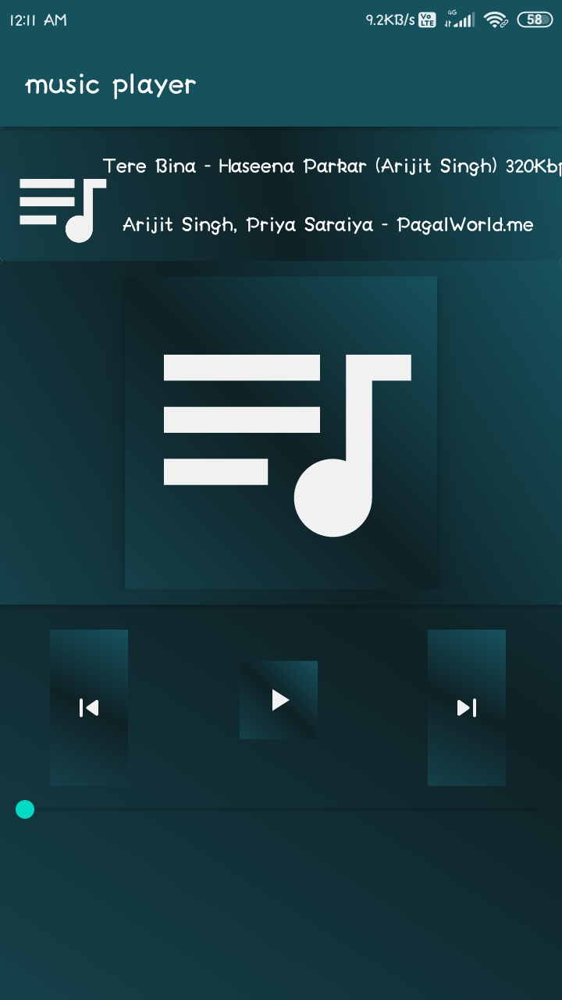

# music player App in Android Kotlin

This is a simple music player application for begineers , i have used room database to store all the songs in it and also used kotlin coroutines to work in background

